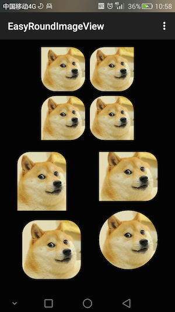
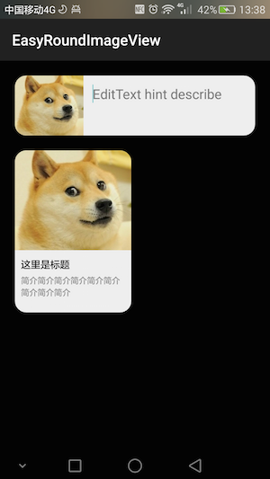

#easy-round-imageview
This is a ImageView extension library, you can specify any corner is round, or it can be a circular ImageView




##Gradle
```
dependencies {
    //...
    compile 'com.hongtian:library:0.1'
}
```

##Usage
```xml
<com.hongtian.easyroundimageview.EasyRoundImageView
    android:layout_width="90dp"
    android:layout_height="90dp"
    android:src="@mipmap/photo_1"
    android:scaleType="centerCrop"
    app:hasLeftBottom="true"
    app:hasRightBottom="true"
    app:hasRightTop="true"
    app:radius="30dp"
    />
```
###Properties
* hasLeftTop boolean
* hasLeftBottom boolean
* hasRightTop boolean
* hasRightBottom boolean
* radius dimension|reference

More usage please see the demo code.

##License
```
   Copyright 2015 hongtianu

   Licensed under the Apache License, Version 2.0 (the "License");
   you may not use this file except in compliance with the License.
   You may obtain a copy of the License at

     http://www.apache.org/licenses/LICENSE-2.0

   Unless required by applicable law or agreed to in writing, software
   distributed under the License is distributed on an "AS IS" BASIS,
   WITHOUT WARRANTIES OR CONDITIONS OF ANY KIND, either express or implied.
   See the License for the specific language governing permissions and
   limitations under the License.
```